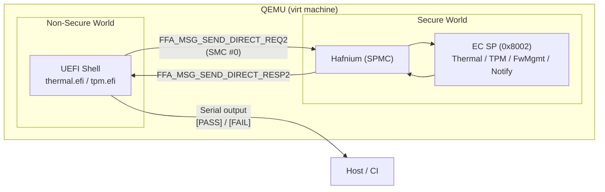

# E2E Tests for Secure Partition Services

End-to-end tests that exercise the EC Secure Partition (SP) running inside QEMU
by sending FF-A messages from the non-secure world and validating responses.

## Overview

The test harness is a set of standalone **Rust UEFI applications** targeting
`aarch64-unknown-uefi`. Each test binary boots in the UEFI Shell, issues FF-A
SMC calls directly to the Secure Partition Manager Core (SPMC / Hafnium), and
reports results over serial.



### Why UEFI Applications?

- **Fast iteration** — rebuild only the test `.efi` binary, not the entire BIOS.
  The firmware (`SECURE_FLASH0.fd` + `QEMU_EFI.fd`) is reused as-is.
- **Lightweight** — each binary is ~32 KB. No OS needed.
- **Direct FF-A access** — UEFI apps run at EL1 and can issue `smc #0` directly,
  the same way the SP's own C test app (`FfaPartitionTestApp.efi`) does.
- **Same language as the SP** — Rust, with shared types from the `odp-ffa` crate.

## Directory Structure

| Directory | Purpose |
| --- | --- |
| `ffa/` | FFA calling library — thin wrapper around `odp-ffa` with `FFA_PARTITION_INFO_GET_REGS` |
| `test-support/` | Shared test harness: `run_tests()`, `send_direct_req2()`, result reporting |
| `uart-logger/` | Minimal PL011 UART logging crate for serial output |
| `tests/thermal/` | Thermal service test suite (`thermal.efi`) |
| `tests/tpm/` | TPM service test suite (`tpm.efi`) |
| `coverage-plugin/` | QEMU TCG plugin for SP code coverage collection |
| `scripts/` | Post-processing tools (e.g., `pcs-to-lcov.py`) |
| `Build/` | Build artifacts: test output, coverage logs/reports, virtual drive |

## How It Works

### 1. Build

Test binaries are compiled with `cargo build --release` inside the devcontainer,
targeting `aarch64-unknown-uefi`. The output is a PE/COFF `.efi` executable.

### 2. Virtual Drive Preparation

The Makefile creates a temporary directory (`Build/vdrive/`) containing:
- The compiled `.efi` test binaries.
- A `startup.nsh` script that auto-runs the tests when UEFI Shell starts.

### 3. QEMU Launch

QEMU boots with:
- The pre-built BIOS firmware (pflash units 0 and 1) — includes TF-A, Hafnium,
  the EC Secure Partition, and UEFI.
- A virtual FAT drive (`-drive file=fat:rw:Build/vdrive,...`) mounted as a disk
  visible to the UEFI Shell.
- `-nographic` — all output goes to serial/stdio.

### 4. Test Execution

The UEFI Shell finds the FAT drive, executes `startup.nsh`, which launches
`thermal.efi`. The test app:

1. **Negotiates FF-A version** — calls `FFA_VERSION` requesting v1.2.
2. **Gets its own partition ID** — calls `FFA_ID_GET`.
3. **Discovers the EC SP** — calls `FFA_PARTITION_INFO_GET_REGS` with the
   Thermal service UUID (`31f56da7-593c-4d72-a4b3-8fc7171ac073`) to find
   partition `0x8002`.
4. **Sends a Direct Request v2** — `FFA_MSG_SEND_DIRECT_REQ2` with thermal
   `get_temperature` command (opcode `0x01`, sensor ID `0`).
5. **Validates the response** — checks status == 0 in the `MsgSendDirectResp2`
   payload.
6. **Reports results** — prints `[PASS]` or `[FAIL]` for each test to serial.
7. **Shuts down QEMU** — calls `uefi::runtime::reset(SHUTDOWN)`.

### 5. Result Collection

The `make test-sp-services` target wraps QEMU execution with `timeout`, captures serial
output to `Build/test-output.log`, then greps for `[PASS]`/`[FAIL]` lines
to determine the overall result.

## FFA Library (`ffa/` crate)

The `ffa` crate is a thin wrapper around
[`odp-ffa`](https://github.com/OpenDevicePartnership/odp-secure-services)
(the same FFA crate used by the Secure Partition itself). It:

- **Re-exports all of `odp_ffa`** — `Version`, `IdGet`, `MsgSendDirectReq2`,
  `MsgSendDirectResp2`, `DirectMessagePayload`, `Function`, `Error`, etc.
- **Adds `FFA_PARTITION_INFO_GET_REGS`** — the only function not yet in
  `odp-ffa`. Uses raw inline-asm SMC since `odp_ffa::smc` is `pub(crate)`.
  Marked with `TODO(odp-ffa)` for future upstreaming.

This means test code uses the **same types and UUID encoding** as the SP,
preventing drift between the two sides.

## FF-A Messaging Protocol

Tests communicate with the EC SP using **FF-A Direct Message v2** (Req2/Resp2).
The register layout for an `FFA_MSG_SEND_DIRECT_REQ2` SMC is:

| Register | Contents |
|----------|----------|
| x0 | Function ID (`0xC400008D`) |
| x1 | `(source_id << 16) \| destination_id` |
| x2 | Service UUID high 64 bits (big-endian u64) |
| x3 | Service UUID low 64 bits (big-endian u64) |
| x4–x17 | Payload arguments (Arg0–Arg13) |

The payload is serialized as a `DirectMessagePayload` — a 112-byte (14 × 8)
register blob accessed via `u8_at()`, `u16_at()`, `u64_at()`, etc.

For the Thermal `get_temperature` command specifically:
- **Request**: byte 0 = opcode (`0x01`), byte 1 = sensor_id (`0x00`)
- **Response**: bytes 0–7 = status (i64), bytes 8–15 = temperature (u64)

## Running

### Prerequisites

- BIOS firmware must be built first: `make all` from the repo root.
- The devcontainer must have the `aarch64-unknown-uefi` Rust target installed
  (included in the Dockerfile).

### Commands

```bash
# Build test EFI binaries only
make -C e2e-tests build

# Run with timeout + pass/fail reporting (for CI)
make -C e2e-tests test-sp-services

# Full pipeline: build everything then run tests
make e2e-test
```

### Adjusting the Timeout

The default QEMU timeout is 180 seconds. Override with:

```bash
make -C e2e-tests test-sp-services QEMU_TIMEOUT=60
```

### Expected Output

```
=== EC Secure Partition E2E Tests ===
  FFA version: 1.2
[PASS] ffa_version
  Our partition ID: 0x0000
[PASS] ffa_id_get
  Found EC partition: id=0x8002 ctx=1 props=0x00000603
[PASS] partition_discovery
  get_temperature response: status=0, temp=0x1234
[PASS] thermal_get_temperature
--- Results: 4 passed, 0 failed ---
```

## Adding New Tests

### New test for an existing service

Add a new `fn test_*()` function in the relevant test binary (e.g.,
`tests/thermal/src/main.rs`) and call it from `main()`.

### New test binary for a different service

1. Create `e2e-tests/tests/<service>/Cargo.toml` and `src/main.rs`.
2. Add it to the workspace in `e2e-tests/Cargo.toml`:
   ```toml
   members = ["ffa", "uart-logger", "test-support", "tests/thermal", "tests/<service>"]
   ```
3. Update `e2e-tests/Makefile`:
   - Add the new `.efi` path (e.g. `<SERVICE>_EFI := $(TARGET_DIR)/<service>.efi`).
   - Add a per-test vdrive dir (e.g. `VDRIVE_<SERVICE>_DIR := Build/vdrive-<service>`)
     and a target that stages it: `$(call make-vdrive,$(VDRIVE_<SERVICE>_DIR),$(<SERVICE>_EFI))`.
   - No startup script needed — the shared generic `startup.nsh` runs whichever
     single `.efi` is on the vdrive.

### Service UUIDs

The EC Secure Partition (0x8002) handles these services:

| Service | UUID |
|---------|------|
| Inter-Partition / Notification | `e474d87e-5731-4044-a727-cb3e8cf3c8df` |
| EC Management | `330c1273-fde5-4757-9819-5b6539037502` |
| EC Power | `7157addf-2fbe-4c63-ae95-efac16e3b01c` |
| EC Battery | `25cb5207-ac36-427d-aaef-3aa78877d27e` |
| EC Thermal | `31f56da7-593c-4d72-a4b3-8fc7171ac073` |
| TPM 2.0 | `17b862a4-1806-4faf-86b3-089a58353861` |

These are defined in the SP's device tree manifest
(`secure-services/platform/linker/qemu-ec-sp.dts`).

## Code Coverage

E2E tests automatically collect code coverage for the EC Secure Partition
using a QEMU TCG plugin. Every `make test-sp-services` run produces a coverage log at
`Build/coverage.log`.

### How it works

1. **TCG plugin** (`coverage-plugin/coverage.c`) — a small shared library
   loaded into QEMU via `-plugin`. During translation, it instruments every
   instruction whose address falls within the SP memory range
   (`0x20802000`–`0x21002000`, matching the linker script). On execution, it
   sets a bit in a lock-free bitmap. At exit, it writes all unique executed PCs
   to the output file.

2. **Post-processing** (`scripts/pcs-to-lcov.py`) — extracts all instruction
   addresses from the SP ELF via `llvm-objdump`, resolves every address to a
   source file and line via `llvm-addr2line`, then overlays the executed PCs to
   produce an lcov tracefile. Lines that exist but weren't executed appear as
   `DA:line,0`, giving accurate coverage percentages.

3. **HTML report** — `genhtml` converts the lcov tracefile into a browsable
   HTML report.

### Prerequisites

The SP ELF must be built with debug info so `llvm-addr2line` can resolve
addresses. This is configured via `debug = true` in the `[profile.coverage]`
section of `secure-services/platform/Cargo.toml`, which is used for e2e test
and coverage builds.

### Commands

```bash
# Run tests with coverage (builds secure-services with coverage profile)
make e2e-test

# Generate HTML coverage report
make -C e2e-tests coverage-report
# Output: e2e-tests/Build/coverage-html/index.html

# Build only the coverage plugin
make -C e2e-tests Build/libcoverage.so
```

### Directory structure

```
e2e-tests/
├── coverage-plugin/
│   ├── coverage.c          # QEMU TCG plugin source
│   ├── qemu-plugin.h       # Vendored minimal plugin API header
│   └── Makefile             # Builds Build/libcoverage.so
├── scripts/
│   └── pcs-to-lcov.py      # PC-to-lcov conversion script
└── Build/
    ├── libcoverage.so       # Compiled coverage plugin
    ├── coverage.log         # Raw PCs (one hex address per line)
    ├── coverage.info        # lcov tracefile
    └── coverage-html/       # HTML report (genhtml output)
```
