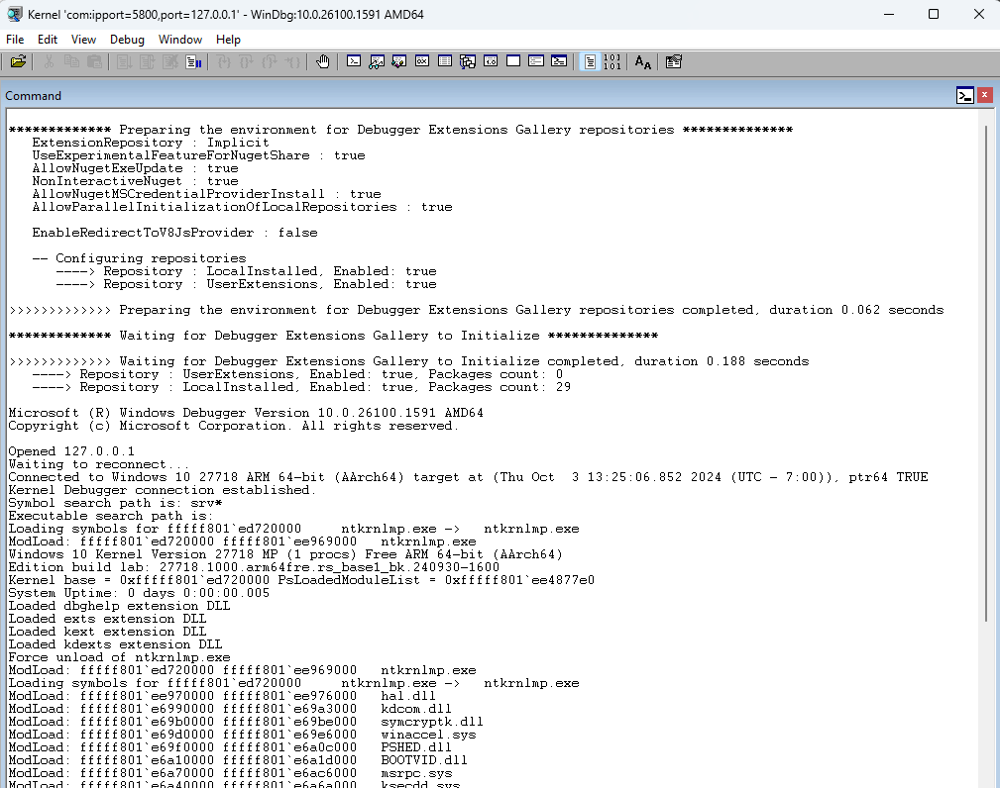

# Windbg Setup for QEMU

For general instructions see postbuild/os/README.md

## Enabling Windbg
If Windows doesn't boot properly on QEMU you are basically stuck wondering what is happening with no output after bootmgr starts there will be no further update in the serial port. To debug windows we need to connect windbg to the QEMU to see what is happening as drivers boot.

As long as you pull the published windows image it has Windbg enabled by default. If you don't attach the debugger it will continue to boot after 30 seconds.

```
    Write-Host "Enabling debug"
    bcdedit /store ${efiLetter}:\EFI\Microsoft\Boot\BCD /set "{default}" debug on
```

If you want to debug early boot process because it is not making it into NTOS you can enable bootdebug as well

`bcdedit /store BCD /set {globalsettings} bootdebug yes`

Windbg can be connected on  `windbg -k com:ipport=56789,port=127.0.0.1 -v`



## Debugging QEMU with GDB
When debugging in UEFI, secure world, or when system isn't responding you will often find yourself needing a GDB connection to the device.
QEMU has built in support for GDB interface and makes it very easy to debug with GDB.

Ffter your system starts or is in the state you want to connect you can use
```
gdb-multiarch
(gdb) set debug aarch64
(gdb) target extended-remote localhost:5555

```
For more details debugging with GDB or using Windbg with GDB you can read the following documents.
[Patina Debugging](https://github.com/OpenDevicePartnership/patina-qemu/tree/main/docs/src/debugging)
